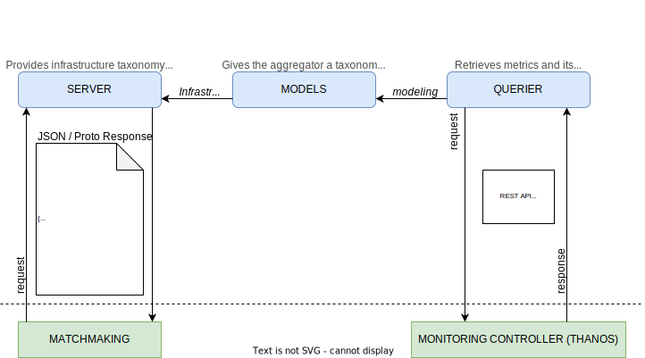

# Aggregator architecture



Aggregator service provides a simple way to query information about a multi-cluster system. It launches a server that, when connected, returns available data about clusters and their states.

## Interfaces documentation

### HTTP
Topology information and infrastructure data is served via HTTP following the data structure defined in the Swagger documentation located at [./docs](./docs).

## Modules
### Server
Two different servers are implemented: HTTP and gRPC. They listen on the provided port passed as enviroment variable and call the models module every time a client request is received. It is possible to choose among any of them to be launched or to start both at the same time.

### Models
Data taxonomy is defined in *models.go* as Golang structs. 
The file *modeler.go* sends different queries (using *querier.go*) to Thanos and stores the received data. Once completed, it returns all the information in JSON format for web server and in the proto buffer defined format for gRPC server.

### Querier
Creates Prometheus API client and sends a query to Thanos. It retrieves the metrics and returns them in a response vector.


## Execution

#### Building the aggregator:
```bash
docker build . -t icos-aggregator
```
  
#### Launching the aggregator:

- PROMETHEUS_ADDRESS: The address where Prometheus/Thanos is located.  
- HTTP_PORT: If set, HTTP server is launched at port HTTP_PORT.  
- GRPC_PORT: If set, gRPC server is launched at port GRPC_PORT.
- KEY: If set, Keycloak is enabled and public key set as KEY.

If no port is provided, aggregator launches an HTTP server at port 8080 by default.

```bash
docker run -p 8080:8080 -p 8181:8181 -e PROMETHEUS_ADDRESS=http://thanos.192.168.137.200.nip.io/ -e HTTP_PORT=8080 -e GRPC_PORT=8181 icos-aggregator
```
(Note: HTTP_PORT/GRPC_PORT must be published with the option -p to be able to run the container correctly)

Current Key:
```bash
KEY=MIIBIjANBgkqhkiG9w0BAQEFAAOCAQ8AMIIBCgKCAQEAgTGF4mKVEa+eWX0S/+EWIfkkqbLba5WuQ1KKGRQz+P56Y0WNRbgjNl0CObndffmixbpgp4kg5jKq78HoFFP7bj0jQSNC3P26K9xPolFXbAlNJe41VMdI7xOkOF0D9GCplEylGlUlCgpaBnbloI4WcbH+RQ6n6Qp6MmNE+/xC3OMMhgEBacbiGtIR71N/HcDYDUORE335sSRpkrHhMxk3eWgZdIyfX88n9UkI3CtgNGIGgF8/w7ZYF2XBmVuv5+QE9d5fM9pZKWQnzBnsMJy4Xc+qZrZMI45KCHIW/DSFVGSsGboiVHSNVOu3mNhPSjvJtIH/7lItCG6m5zvBAvNf8QIDAQAB
```

#### Connecting to the aggregator with HTTP server:
```bash
curl localhost:8080
```
  
  
#### Connecting to the aggregator with gRPC server (via ETIM client test file):
```bash
export AGGR_ADDRESS=localhost && export GRPC_PORT=8182 && go run test/protobuf/etim/server_client.go 
```

# Legal
The Aggregator is released under the Apache 2.0 license.
Copyright © 2022-2024 Bull SAS. All rights reserved.

🇪🇺 This work has received funding from the European Union's HORIZON research and innovation programme under grant agreement No. 101070177.
