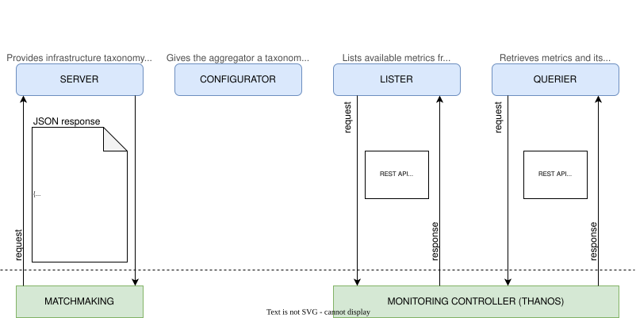

# Aggregator architecture



Aggregator service provides a simple way to query information about a multi-cluster system. It launches a web server, that, when connected, returns in JSON format all available data about the clusters and their states.

## Modules
### Server
Initializes the server (currently on port :8080) and sets the handler function for http requests.

### Models
Data taxonomy is defined in *models.go* as Golang structs. 
The file *modeler.go* sends different queries (using *querier.go*) to Thanos and stores the received data. Once completed, it returns all the information in JSON format.

### Querier
Creates Prometheus API client and sends a query to Thanos. It retrieves the metrics and returns them in a response vector.


## Execution
Building the aggregator:
```bash
docker build . -t icos-aggregator
```

Launching the aggregator:
```bash
docker run -p 8080:8080 -e PROMETHEUS_ADDRESS=http://thanos.192.168.137.200.nip.io/ icos-aggregator
```

Connecting to the aggregator:
```bash
curl localhost:8080
```
